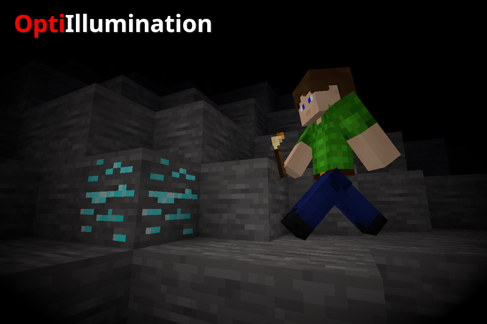

# OptiIllumination (Optimized Illumination) [optiIllumanition]

**OptiIllumination** is an optimized, high-performance fork of the popular Minetest illumination mod. It uses position caching and a throttled globalstep to significantly **reduce CPU load** while maintaining identical visual functionality.

**Functionality:**
Makes players emit light while holding any luminescent item. The amount of light emitted equals the brightness of the item. Luminescent armor is also supported when [`3d_armor`](https://github.com/minetest-mods/3d_armor) is installed.

**Repository:**
The source code is available here: **https://github.com/Tixe-SC3K/optiillumination/**

**Credits and Origin:**
* This mod is based on the original **Illumination** mod.
* Original Author: **"Piezo\_"** (Copyright 2018).
* Fork Author and Optimization: **Tixe** (Copyright 2025).

 

---

Copyright (C) 2018 "Piezo\_" (Original Illumination mod)
Copyright (C) 2025 Tixe (Optimization and Fork)

This mod is free software: you can redistribute it and/or modify
it under the terms of the GNU General Public License as published by
the Free Software Foundation, either version 3 of the License, or
(at your option) any later version.

This mod is distributed in the hope that it will be useful,
but WITHOUT ANY WARRANTY; without even the implied warranty of
MERCHANTABILITY or FITNESS FOR A PARTICULAR PURPOSE. See the
GNU General Public License for more details.

You should have received a copy of the GNU General Public License
along with this mod. If not, see <http://www.gnu.org/licenses/>.
